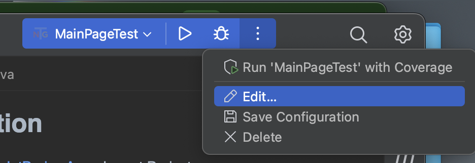

# SelenideTestNgPOC

## Installation

1. Download [JetBrains Aqua](https://www.jetbrains.com/aqua/)
Import Project

2. Open the Maven sidebar by clicking on the M icon

3. Click on Maven Install 

## Run

1. Click on the 3 dot dropdown in the blue test config bar and select Edit 
2. Make sure the class option and MainPageTest class is selected 
3. You can also run by Group by clicking on Test Kind and selecting Group, then entering one of the two groups in the project.